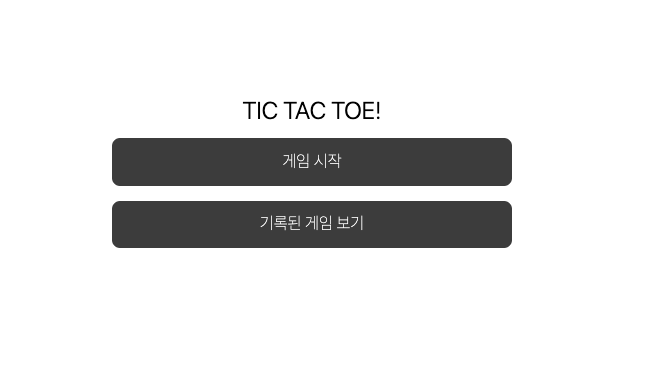
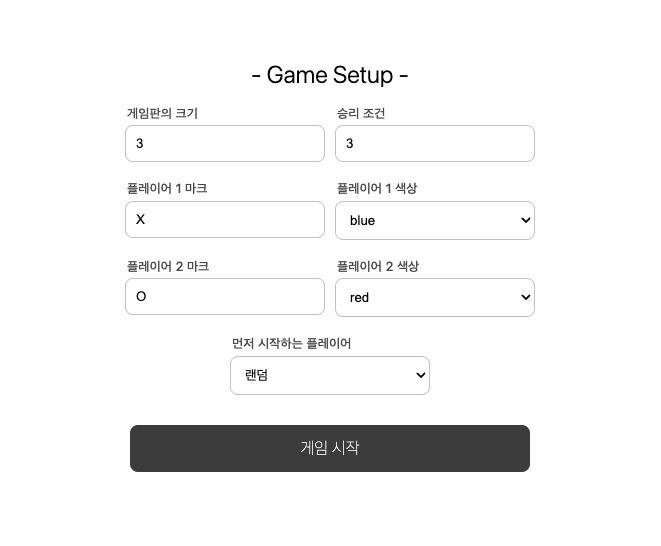
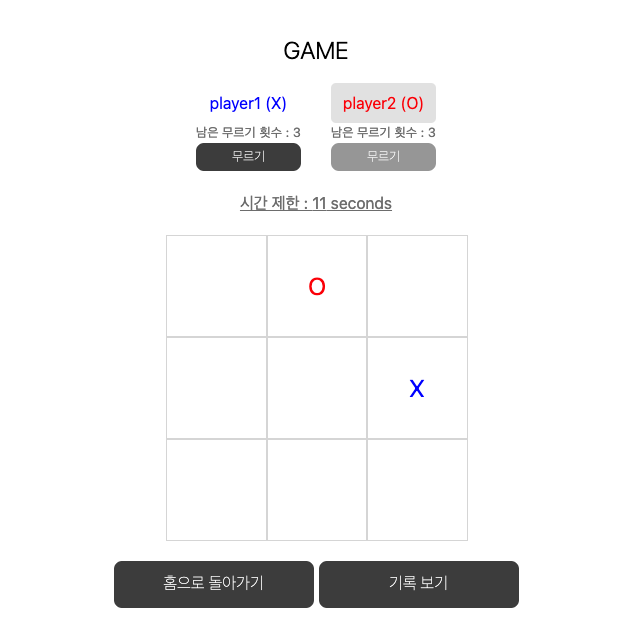
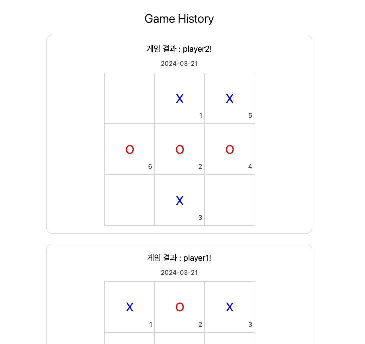

# Tic-Tac-Toe

Tic Tac Toe 게임의 변형입니다. 두 명의 플레이어가 게임을 하고, 3x3 크기 이상의 게임보드에 자신의 마크를 승리조건으로 설정한 숫자 이상 놓는 쪽이 승리하게 됩니다.

### 📍 게임 규칙

- 게임보드는 3x3, 4x4, 5x5 또는 그 이상의 격자 형태입니다.
- 플레이어 두명은 번갈아 가면서 마크가 없는 격자 칸 하나에 자신의 마크를 표시합니다.
- 마크를 놓았을 때 가로, 세로, 또는 대각선 방향으로 승리조건(최소 3, 최대 게임판의 행 숫자)으로 설정한 숫자로 놓였다면 해당 마크를 놓은 플레이어가 승리합니다.
- 모든 칸이 마킹되었지만 어느 플레이어도 승리하지 못한 경우 무승부가 됩니다.
- 각 플레이어는 게임 종료 전일 경우 각자 3회까지 무르기가 가능합니다. 무르기를 하면 마지막 마크가 놓이기 전의 상황으로 돌아갑니다.
- 플레이어가 자신의 차례일 때 15초 이내에 마크를 놓지 않으면, 빈 칸 중 하나에 랜덤하게 마크를 놓고 차례를 넘기게 됩니다.
- 새 차례가 시작되면 제한 시간은 15초로 초기화 됩니다.

### 📍 프로젝트 실행

1. `npm install`

2. `npm run dev`

### 📍 기능 설명

- 홈 화면

- 게임 설정

- 게임 진행

- 게임 기록 조회

